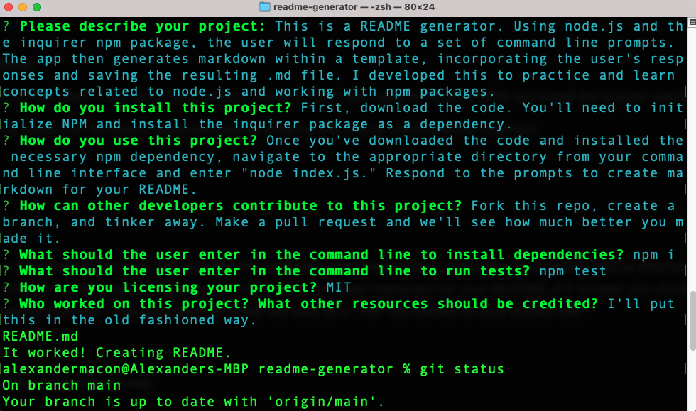

# readme-generator

[]

## Description

This is a README generator. Using node.js and the Inquirer NPM package, the user will respond to a set of command line prompts. The app then generates markdown within a template, incorporating the user's responses and saving the resulting .md file. I developed this to learn concepts related to node.js and to get experience working with NPM packages including Inquirer and node modules like fs. This also allowed me to continue—as always—practicing JavaScript, particularly callback functions, object destructuring, and spread syntax.

[Here's a link to a video demo showing the README generator in action](https://drive.google.com/file/d/1ABlOvcJX1FA7pPAnOlrm02UJkzmfVbn4/view)


## Table of Contents

- [Installation](#installation)
- [Usage](#usage)
- [Credits](#credits)
- [License](#license)

## Installation

First, download the code. If you don't have node.js, install it. You'll also need to initialize NPM and install the inquirer package as a dependency.

You'll need to install the necessary dependencies by entering this in your command line interface:
```
npm i
```

## Usage

Once you've downloaded the code and installed the necessary npm dependency, navigate to your project's local directory from your command line interface and enter "node index.js." Respond to the prompts to create markdown for your README. If it worked, you should see a message log reading "It worked! Creating README." The generated README will save as a ".md" file named for your project title.



## Credits

The following links and documentation proved helpful as I was working on this:
- https://www.npmjs.com/
- https://www.npmjs.com/package/inquirer
- https://developer.mozilla.org/en-US/docs/Web/JavaScript/Reference/Operators/Spread_syntax
- https://gist.github.com/lukas-h/2a5d00690736b4c3a7ba
- https://developer.mozilla.org/en-US/docs/Web/JavaScript/Reference/Template_literals
- https://opensource.org/licenses/MIT


## License

Copyright 2021 ©[alexdmacon](https://github.com/alexdmacon). Shared under the [MIT](https://opensource.org/licenses/MIT) license.

## Contributing

Fork this repo, create a branch, and tinker away. Make a pull request and we'll see how much better you made it.

## Tests

To run tests, enter this in your command line interface: 
```
npm test
```

## Questions

Got questions? Just reach out and ask.

- Email: alexdmacon@gmail.com
- GitHub: [alexdmacon](https://github.com/alexdmacon)
